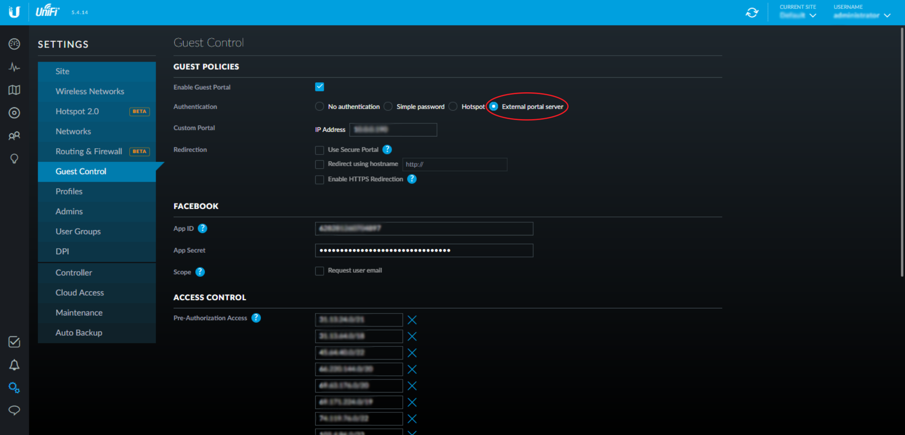

Django-Unifi is a custom portal with individual usernames and passwords or using **Facebook** authentication/registration mechanism.
It is a reusable Django app for interacting with the Unifi AP Controller software, version 4 and 5.

The UniFi® AP is an Access Point ideal for deployment of high-performance wireless networks. [Here](https://www.ubnt.com/unifi/unifi-ap/) you can find more details.


Overview
--------

Django-Unifi works with Django 1.8/1.9/1.10/1.11.
It is based on this [article](https://help.ubnt.com/hc/en-us/articles/204950374-UniFi-Custom-Portal-With-Individual-Usernames-and-Passwords-) from community.

How It Works
--------

When an guest try to connects to a wireless network with the guest policy enabled, http requests are redirected to the django-portal server.
 
When the form is submitted or the Facebook sign in has been validated, Django validates the user and then uses the Unifi API to authorize the guest’s MAC address.

Quick start
-----------

-  Setup Django-Unifi application in Python environment:


       $ pip install git+https://github.com/bsab/django-unifi-portal.git


-  Migrate the unifi_portal app to create the user model:


        $ migrate unifi_portal

-  Add "unifi_portal" to your INSTALLED\_APPS setting like this:

   ```python

       INSTALLED_APPS = (
           ...,
           'unifi_portal',
       )
   ```
- Add these variables to your settings.py:

    ```python
    #################################################
    #                 UNIFI CONFIGURATION           #
    #################################################
    UNIFI_SERVER = "<your UniFi Server ip>
    UNIFI_PORT=<your Unifi Server Port> # default is 8443
    UNIFI_VERSION='v4'
    UNIFI_SITE_ID='default'
    
    #It's important to note that if this server is offsite, you need to have port 8443 forwarded through to it
    UNIFI_SSID='<your ssid name>'
    UNIFI_LOGO='<relative path under the static folder to the logo png>'
    
    UNIFI_USER = "<your UniFi Username>"
    UNIFI_PASSWORD = "<your UniFi Password>"
    UNIFI_TIMEOUT_MINUTES = <minutes to offer free wifi> # ex. 8 hours is 480
    
    # Facebook configuration
    SOCIAL_AUTH_FACEBOOK_KEY = unifi
    SOCIAL_AUTH_FACEBOOK_SECRET = unifi
    ```

You need to map the views to an url in url.py file:

    ```python
    url(r'^auth/', include('rest_framework_social_oauth2.urls')),
    url(r'', include(unifi_urls)),
    ```


-  If you want you can use the base UnifiUser model or extend it defining a simple model like this example:

    ```python
    from unifi_portal.models import UnifiUser
    class CustomUnifiUser(UnifiUser):
       nick = models.CharField(max_length=100)

Unifi Server Configuration
--------

Last, setup UniFi to point to the IP of the django portal al server. You can test authentication by inserting a dummy account in to the database.



It's important to note that you cannot include folders in your External Portal option, just an IP address.  You can either modify the default Apache2 index.html file to redirect to the appropriate path, or create a symlink to the guest/s/default/index.php file.

## Contributing

Contributions welcome; Please submit all pull requests against the master branch. If your pull request contains Python patches or features, you should include relevant unit tests.
Thanks!

## Author

[Sabatino Severino](https://about.me/the_sab), @bsab

## License

Django-Unifi is available under the MIT license. See the LICENSE file for more info.

## Disclaimer
Ubiquiti will not support this code.  It is provided simply as an example of a rudimentary, functioning external portal.

