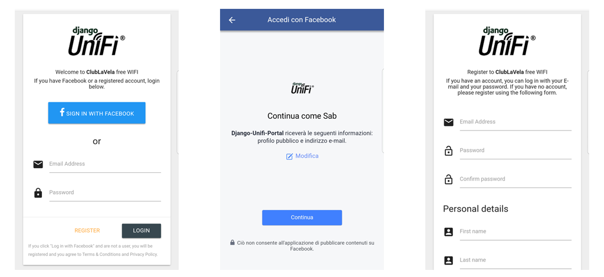

Django-Unifi-Portal is a custom portal based on two authentication/registration mechanism:
- **_Django_** user authentication system
- **_Facebook_** OAuth2 logging. 

It is a powerful reusable Django app for interacting with the Unifi AP Controller software, version 4 and 5.

The UniFi® AP is an Access Point ideal for deployment of high-performance wireless networks. [Here](https://www.ubnt.com/unifi/unifi-ap/) you can find more details.



Overview
--------

Django-Unifi-Portal works with Django 1.10/1.11.
It is based on this [article](https://help.ubnt.com/hc/en-us/articles/204950374-UniFi-Custom-Portal-With-Individual-Usernames-and-Passwords-) from community.

How It Works
--------

When an guest try to connects to a wireless network with the guest policy enabled, http requests are redirected to the django-portal server.
 
When the form is submitted or the Facebook sign in has been validated, Django validates the user and then uses the Unifi API to authorize the guest’s MAC address.

Quick start
-----------

-  Setup Django-Unifi-Portal application in Python environment:


       $ pip install django-unifi-portal


-  Migrate the django_unifi_portal app to create the user model:


        $ migrate django_unifi_portal

-  Add "django_unifi_portal" to your INSTALLED\_APPS:

   ```python

       INSTALLED_APPS = (
           ...,
           'django_unifi_portal',
       )
   ```
   
- Copy this configuration and paste it on file named unifi_settings.py:

    ```python
    from django.core.urlresolvers import reverse_lazy
    
    UNIFI_INSTALLED_APPS = [
        # material apps
        'material',
        'oauth2_provider',
        'social_django',
        'rest_framework_social_oauth2',
        'django_unifi_portal',
    ]
    
    UNIFI_LOGIN_URL = '/unifi-portal/login'
    UNIFI_LOGIN_REDIRECT_URL = reverse_lazy('index')
    
    UNIFI_TEMPLATE_CONTEXT_PROCESSORS = [
            'material.frontend.context_processors.modules',
            'social_django.context_processors.backends',
            'social_django.context_processors.login_redirect',
            'unifi_portal.context_processor.unifi_context'
    ]
    
    UNIFI_TEMPLATE_BUILTINS = 'material.templatetags.material_form'
    
    UNIFI_AUTHENTICATION_BACKENDS = (
    
        # Others auth providers (e.g. Google, OpenId, etc)
    
        # Facebook OAuth2
        'social_core.backends.facebook.FacebookAppOAuth2',
        'social_core.backends.facebook.FacebookOAuth2',
    
        # Django
        'django.contrib.auth.backends.ModelBackend',
    
    )
    
    UNIFI_SOCIAL_AUTH_PIPELINE = (
        'social_core.pipeline.social_auth.social_details',
        'social_core.pipeline.social_auth.social_uid',
        'social_core.pipeline.social_auth.auth_allowed',
        'django_unifi_portal.pipeline.manage_auth_already_associated',
        'social_core.pipeline.social_auth.social_user',
        'social_core.pipeline.user.get_username',
        'django_unifi_portal.pipeline.require_email',
        'social_core.pipeline.mail.mail_validation',
        'social_core.pipeline.user.create_user',
        'social_core.pipeline.social_auth.associate_user',
        'social_core.pipeline.debug.debug',
        'social_core.pipeline.social_auth.load_extra_data',
        'social_core.pipeline.user.user_details',
        'django_unifi_portal.pipeline.user_details',
        'django_unifi_portal.pipeline.save_profile',
        'social_core.pipeline.debug.debug',
    )
    
    # Define SOCIAL_AUTH_FACEBOOK_SCOPE to get extra permissions from facebook.
    # Email is not sent by default, to get it, you must request the email permission:
    SOCIAL_AUTH_FACEBOOK_SCOPE = ['email']
    SOCIAL_AUTH_FACEBOOK_PROFILE_EXTRA_PARAMS = {
        'fields': 'id, name, about, email, birthday, gender, hometown, languages'
    }
    
    UNIFI_SERVER = "<your UniFi Server ip>
    UNIFI_PORT = <your Unifi Server Port>  # default is 8443
    UNIFI_VERSION = 'v4'
    UNIFI_SITE_ID = 'default'
    
    # It's important to note that if this server is offsite, you need to have port 8443 forwarded through to it
    UNIFI_SSID = '<your ssid name>'
    UNIFI_LOGO = '<relative path under the static folder to the logo png>'
    
    UNIFI_USER = "<your UniFi Username>"
    UNIFI_PASSWORD = "<your UniFi Password>"
    UNIFI_TIMEOUT_MINUTES = <minutes>  # ex. 8 hours is 480
    
    # Facebook configuration
    SOCIAL_AUTH_FACEBOOK_KEY = "<your Facebook key>"
    SOCIAL_AUTH_FACEBOOK_SECRET = "<your Facebook api secret>"
    ```

- Then add this configuration to your settings.py:
    ```python
    #################################################
    #                 UNIFI CONFIGURATION           #
    #################################################
    from unifi_settings import *
    
    INSTALLED_APPS += UNIFI_INSTALLED_APPS
    
    LOGIN_URL = UNIFI_LOGIN_URL
    LOGIN_REDIRECT_URL = UNIFI_LOGIN_REDIRECT_URL
    
    TEMPLATES[0]['OPTIONS']['context_processors'] += UNIFI_TEMPLATE_CONTEXT_PROCESSORS
    
    # shortcut for in form templates
    try:
        # shortcut for in form templates
        from django.template.base import add_to_builtins
        add_to_builtins(UNIFI_TEMPLATE_BUILTINS)
    except ImportError:
        """
        Django 1.9.
        """
        TEMPLATES[0]['OPTIONS']['builtins'] = [
            UNIFI_TEMPLATE_BUILTINS,
        ]
    
    AUTHENTICATION_BACKENDS = UNIFI_AUTHENTICATION_BACKENDS
    SOCIAL_AUTH_PIPELINE = UNIFI_SOCIAL_AUTH_PIPELINE
    ```
    
- You need to map the views to an url in url.py file:

    ```python
    url(r'', include('django_unifi_portal.urls')),
    ```


-  If you want you can use the base UnifiUser model or extend it defining a simple model like this :

    ```python
    from unifi_portal.models import UnifiUser
    class CustomUnifiUser(UnifiUser):
       nick = models.CharField(max_length=100)

Unifi Server Configuration
--------

Last, setup UniFi to point to the IP of the django portal al server. You can test authentication by inserting a dummy account in to the database.


It's important to note that you cannot include folders in your External Portal option, just an IP address.  You can either modify the default Apache2 index.html file to redirect to the appropriate path, or create a symlink to the guest/s/default/index.php file.

## Contributing

Contributions welcome; Please submit all pull requests against the master branch. If your pull request contains Python patches or features, you should include relevant unit tests.
Thanks!

## Author

[Sabatino Severino](https://about.me/the_sab), @bsab

## License

Django-Unifi-Portal is available under the MIT license. See the LICENSE file for more info.

## Disclaimer
Ubiquiti will not support this code.  It is provided simply as an example of a rudimentary, functioning external portal.

##PLEASE NOTE: This package is still in development so please use with caution.


